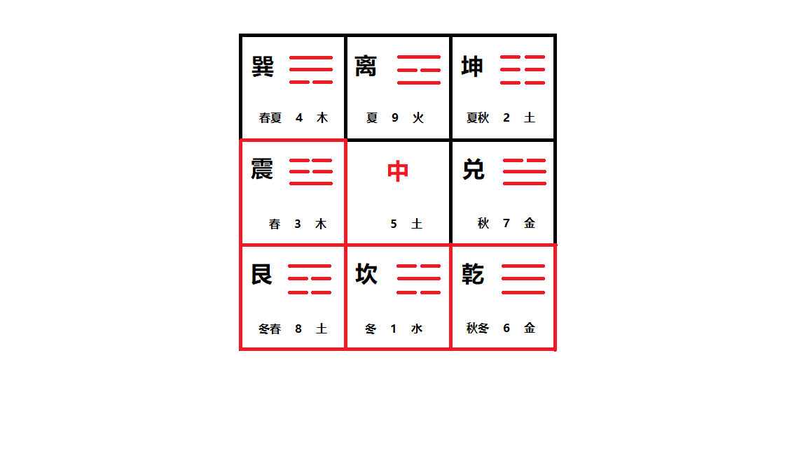

基础知识之阴阳
===================================================================================

## 八卦九宫

+ 红框中的卦为阳：亁、坎、艮、震。
+ 蓝框中的卦为阴：巽、离、坤、兑。

## 后天八卦
上图中的八卦即为后天八卦：**震、巽、离、坤、兑、亁、坎、艮**。

**帝出乎震，齐乎巽，相见乎离，致役乎坤，说言乎兑，战乎乾，劳乎坎，成言乎艮**。

「译文」：万物的花蒂出现在震的季节，整齐地生长在巽的季节，形貌显现在离的季节，最需要出力气是在坤的
季节，叶片脱落告诉人们这是兑的季节，冷得全身战抖是在乾的季节，显得疲劳是在坎的季节，万物成功是在艮
的季节。
> “帝”本义：花蒂。象形。甲骨文字形，象花蒂的全形。上面象花的子房，中间象花萼(花瓣外面的绿片)。下面
> 下垂的象雌雄花蕊。
>
> “乎”在。《战国策·楚策》：“游于江海，淹乎大沼。”
> 
>  “相”形貌，壮貌。《荀子·非相》：“长短、大小、美恶形相，岂论也哉？”
>
> “见”显现，出现。《孟子·滕文公上》：“不直，则道不见，我且直之。”
>
> “致”极，最。曹丕《与朝歌令吴质书》：“书问致简，益用增劳。”
>
> “役”劳动力的事，需要出力气的事：劳役，苦役。
>
> “说”通“脱”。脱落。《左传·僖公十五年》：“车说其輹。”
>
> “言”告诉。《史记·魏其武安侯列传》：“将军壮义之，恐亡夫，乃言太尉。太尉乃固止之。”
>
> “战”通“颤”。发抖。丘迟《与陈伯之书》：“闻鸣镝而股战，对穹庐以屈膝。”
>
> “劳”疲劳。《国语·晋语七》：“劳师于戎而失诸华，虽有功，犹得兽而失人也。”
>
> “劳”疲劳。《国语·晋语七》：“劳师于戎而失诸华，虽有功，犹得兽而失人也。”