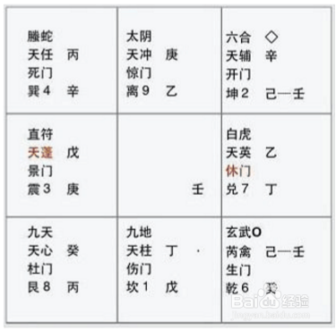

基础知识之天干
===================================================================================
## 天干
甲、乙、丙、丁、戊、己、庚、辛、壬、癸

## 奇门中的天干

每个方格中都有两个天干，**上面的是天盘干，下面的是地盘干**。

**奇门断事时，都是看天盘干。地盘干是配合天盘干使用的，天盘干加上地盘干时就成了格局**。是吉格还是凶
格，这里就有一套特定的理论了，这就叫 **十干克应**。
