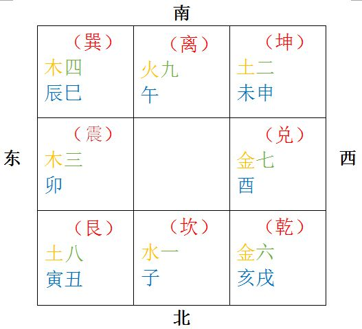

基础知识之地支
===================================================================================
## 地支
子、丑、寅、卯、辰、已、午、未、申、酉、戌、亥

## 地支在奇门局中的位置

后天八卦九宫图：**戴九履一、左三右七、二四为肩、六八为足、五居中央**。

## 地支六合
+ **子丑合化土**
+ **寅亥合化木**
+ **卯戌合化火**
+ **辰酉合化金**
+ **已申合化水**
+ **午未合化土**

## 地支三合
+ **寅午戌三合火局**：火长生在寅、帝旺于午、入墓于戌。
+ **已酉丑三合金局**：金长生在已、帝旺于酉、入墓于丑。
+ **亥卯未三合木局**：木长生在亥、帝旺于卯、入墓于未。
+ **申子辰三合水局**：水长生在申、帝旺于子、入墓于辰。

## 六十甲子与六甲旬首
六甲旬首分别为：
+ 甲戌
+ 甲申
+ 甲午
+ 甲辰
+ 甲寅
+ 甲子

奇门中，甲代表元帅，乙丙丁代表三位大将，戊己庚辛壬癸代表六支军队。甲是不出现的，他隐遁在六只军队中。
例如，甲子隐遁在戊中，所以口决叫：甲子戊。
+ **甲子戊**
+ **甲戌己**
+ **甲申庚**
+ **甲午辛**
+ **甲辰壬**
+ **甲寅癸**

