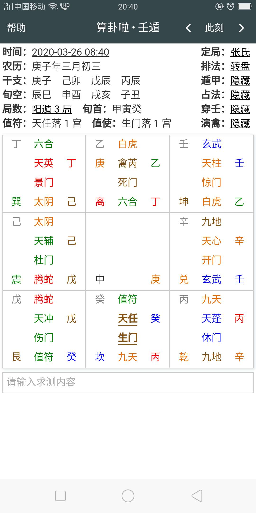

案例1（占访人）
===================================================================================
## 占访人

### 案例描述
2020年3月26号早上我去探望一个三年未联系上的长辈，早上辰时出的门，巳时到的他家，去前我用出门时间用
张岩客掌上起的局，你们看看我昨天去见到吗？

### 反馈结果
结果是没见到这个长辈，只见到他的儿子，本人被女儿接去耍了（于我去的前一天)

### 案例回顾
空

