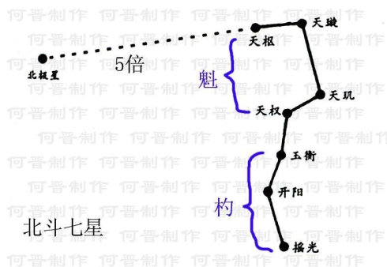

太阳历法
===================================================================================
关于太阳历法的讨论，仍要从“**周天历度**”谈起。看到了伏羲用来测度的精确“工具”。可它是上天赐予的，
又怎么能称为“工具”呢？美哉“神器”！**它每天绕北极星顺时针运行一周，却又过一度。而太阳一日经天一
周，相对于它反而好像是逆时针退了一度**。这样，天赐“神器”与太阳渐行渐远，一年后复会于预先设定的起
迄点，成其岁功。用这个“神器”定度，胜过所有人造的工具，要问何方“神器”，答案就是“**北斗七星**”！

> 起迄（qi）点： 起终点，迄点就是终点；

北斗星日行一度，像一块悬挂在天上的“挂钟”，周365度有奇（实际行度约365度1/4）。对北斗星更细致地观
测还会发现，**约经45天北斗星的斗杓会指向周天上四立、分至八节的位置，这就为进一步在周天上标记24节气，
区分阳历历月奠定了数据的基础**。

